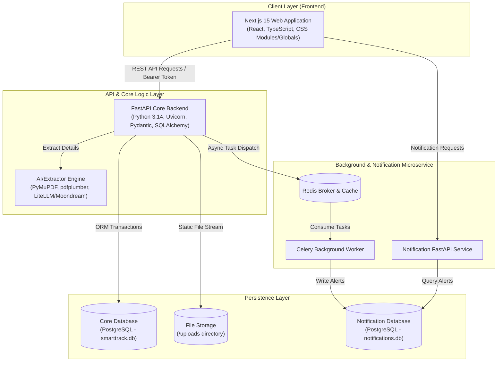
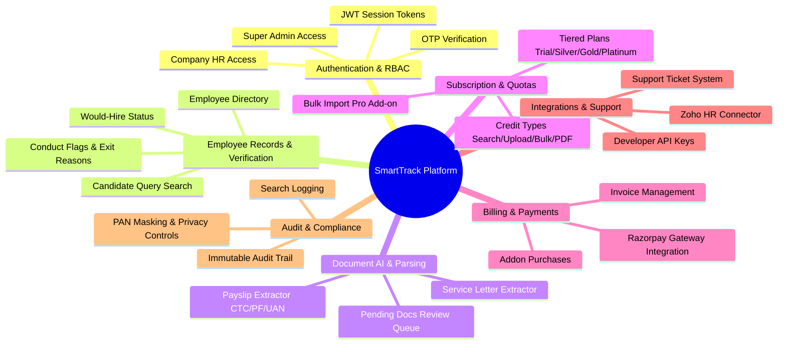
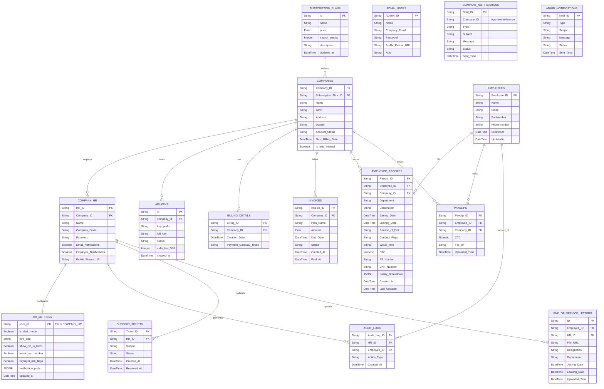
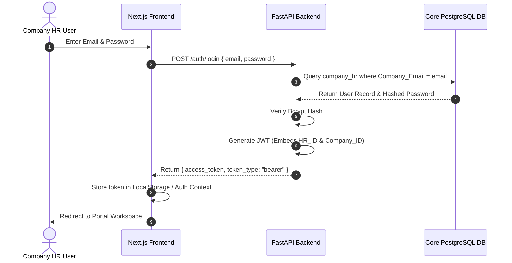
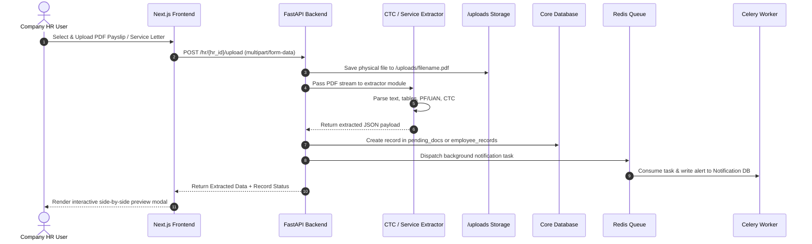
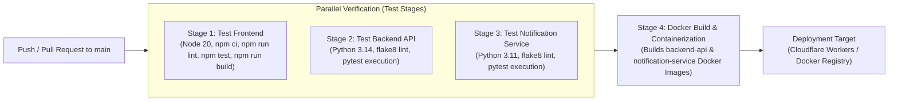

# SmartTrack Project Documentation: Comprehensive Technical & Feature Guide

---

## 1. Executive Summary & Project Overview

### 1.1 What is SmartTrack?
**SmartTrack** is an enterprise-grade Human Resources (HR) verification, employee lifecycle management, and background intelligence platform. Designed to eliminate employment fraud, streamline HR operations, and automate document verification, SmartTrack enables companies to maintain reliable employee records, verify candidate histories, track salary structures, and manage subscription quotas seamlessly.

### 1.2 Core Problem Solved
Traditional hiring and candidate screening processes suffer from:
1. **Unverifiable Employment Histories**: Resume embellishment, false tenure, and unrecorded disciplinary exits.
2. **Manual Document Processing**: High labor costs and errors associated with manually reviewing PDF payslips and End-of-Service letters.
3. **Fragmented Records**: Lack of centralized audit trails for employee conduct, re-hire eligibility, and compliance tracking.
4. **Integration Barriers**: Difficulty connecting legacy HR tools with external candidate background check systems.

SmartTrack resolves these issues by providing a unified platform where verified employers can upload, search, cross-check, and analyze employee records with automated AI parsing, credit-driven quota management, and real-time risk flagging.

---

## 2. High-Level Architecture & Technology Stack

SmartTrack employs a modern, decoupled **microservices architecture** consisting of a Next.js single-page application frontend, a FastAPI core API, a dedicated background notification microservice powered by Celery and Redis, and isolated PostgreSQL databases.



### 2.1 Technology Stack Summary

| Layer | Technologies & Libraries Used |
| :--- | :--- |
| **Frontend** | Next.js 15 (App Router), TypeScript, React 19, Lucide Icons, Axios, Native CSS / Global Tokens |
| **Core API Backend** | FastAPI, Uvicorn (ASGI), Python 3.14, Pydantic v2, SQLAlchemy ORM |
| **Background Processing**| Celery, Redis (Message Broker), Python 3.11 |
| **Notification Service** | FastAPI (Microservice), SQLAlchemy, Alembic Migrations |
| **Document Parsing / AI** | PyMuPDF (`fitz`), `pdfplumber`, LiteLLM / Moondream Vision model integrations |
| **Databases** | PostgreSQL (Production/Neon cloud ready) / SQLite (Local dev execution) |
| **Auth & Security** | JWT (JSON Web Tokens), Passlib (Bcrypt hashing), Custom RBAC Dependencies |
| **Integrations** | Zoho People API Connector, Razorpay Payment Gateway integration |
| **DevOps & CI/CD** | GitHub Actions, Docker, Docker Compose, Multi-stage builds |

---

## 3. Comprehensive Feature Matrix & Module Breakdown



### 3.1 Authentication & Role-Based Access Control (RBAC)
- **Multi-Portal Gateways**:
  - **Admin Portal (`/admin-portal`)**: Restricted interface for platform Super Admins.
  - **Telio / HR Portal (`/telio-portal` or `/login`)**: Dedicated workspace for company managers and HR personnel.
- **Role Hierarchy**:
  - `SUPER_ADMIN` / `ADMIN`: Global governance, company approval, billing adjustments, and platform analytics.
  - `COMPANY_HR`: Managed company profile, candidate searches, employee record creation, document processing, and subscription management.
  - `EMPLOYEE`: Access to individual records and dispute sub-modules.
- **Two-Factor / OTP Verification**: Built-in 6-digit OTP generation and verification for registration, password reset, and sensitive actions (`otps` engine).
- **Stateless Bearer Security**: JWT authentication tokens embedding `HR_ID`, `Company_ID`, and role permissions.

---

### 3.2 Employee Management & Background Intelligence
- **Employee Directory**: Paginated, searchable grid/table view of company workforce. Features cursor-based pagination for high performance with tens of thousands of records.
- **Candidate Verification Search (`QueryCandidate`)**:
  - Performs instant background queries by **PAN Number**, **Email**, or **Phone Number**.
  - Displays complete historical employment timelines across participating companies.
  - Highlights **Conduct Flags** (e.g., policy breach, unauthorized absence) and **Reason for Exit**.
  - Shows explicit **Would-Hire Eligibility** (`Yes`, `No`, `Conditional`) submitted by previous employers.
- **End-of-Service & Exit Records**: Automated letter attachments and formal termination reason capture.

---

### 3.3 Automated Document Extraction & AI Parsing Engine
SmartTrack includes native document parsers that automatically extract structured data from uploaded PDFs:
- **Payslip Extractor (`utils.ctc_extractor`)**:
  - Automatically identifies **Total CTC / Gross Salary**.
  - Extracts **PF (Provident Fund) Number** and **UAN (Universal Account Number)**.
  - Generates a structured **JSON Salary Breakdown** (Basic Pay, HRA, Special Allowance, Deductions).
- **End-of-Service Extractor (`utils.service_letter_extractor`)**:
  - Parses PDF service letters to extract **Joining Date**, **Leaving Date**, **Department**, and **Designation**.
- **Pending Documents Queue (`PendingDocumentsList`)**:
  - Uploaded documents pass into a pending state (`pending_docs` router) allowing HR to visually verify extracted parameters against the raw document side-by-side before committing changes to the main database.
- **Vision LLM Integration**: Support for LiteLLM and Moondream vision models (`test_moondream.py`) for handling non-standard image-based scans.

---

### 3.4 Bulk Data Ingestion Engine
- **CSV/Excel Upload Workspace**: Enables HR teams to bulk import hundreds or thousands of employee records at once.
- **Template Download**: Standardized CSV template generation (`SmartTrack_Bulk_Upload_Template.csv`).
- **Validation Engine**: Pre-validates row formats, mandatory fields, PAN syntax, and email formats, reporting row-by-row errors before insertion.
- **Bulk Import Pro Add-on**: Expands standard per-file import limits from **500 rows** up to **2,000 rows**.

---

### 3.5 Tiered Subscriptions & License Quota Engine
SmartTrack operates a dynamic credit-based quota system enforcing limits on core features based on active subscription tiers.

#### Subscription Tiers Breakdown
| Feature / Credit Type | Trial (₹0) | Silver (₹4,999/mo) | Gold (₹14,999/mo) | Platinum (Custom) |
| :--- | :--- | :--- | :--- | :--- |
| **Search Credits** | 5 | 50 | 200 | Unlimited |
| **Single Upload Credits** | 50 | 500 | 2,000 | Unlimited |
| **Bulk Upload Credits** | 0 | 10 | 50 | Unlimited |
| **PDF Download Credits** | 10 | 100 | 500 | Unlimited |
| **Bulk Row Limit** | 500 rows/file | 500 rows/file | 500 rows/file (2,000 w/ Addon) | Custom |

- **Quota Tracking (`LicenseQuota.tsx` & `routes.pricing`)**:
  - Real-time calculation of remaining vs used credits.
  - Hard enforcement blocking candidate searches or uploads when credits reach zero.
  - Addon top-up mechanism and upgrade workflows.

---

### 3.6 Billing, Invoicing & Payment Gateway
- **Invoice Generation (`routes.invoice`)**: Automated billing cycle tracking, invoice creation, and PDF receipt availability.
- **Razorpay Payment Gateway (`/payment` & `Payment Gateway/`)**: Seamless checkout integration for subscription upgrades and addon purchases.
- **Billing Details Management**: Store payment tokens, view transaction history, and maintain company GSTIN billing profiles.

---

### 3.7 Third-Party Integrations & Developer APIs
- **Zoho HR / Zoho People Connector (`routes.zoho`)**: Bi-directional synchronization of employee directory records between SmartTrack and Zoho HR accounts.
- **External API Keys (`routes.api_key`)**:
  - Generate cryptographically secure API keys (`pk_live_...`).
  - Allows client engineering teams to programmatically push employee records or execute candidate searches.
  - Includes full usage counter tracking (`calls_last_30d`).

---

### 3.8 Support Ticket & Helpdesk System
- **HR Support Requests (`routes.support_ticket`)**: HR users can raise support tickets for platform assistance or data verification queries.
- **Admin Ticket Resolution**: Super Admins monitor, update status (`Open`, `In Progress`, `Resolved`), and resolve tickets from the admin portal.

---

### 3.9 Asynchronous Notification Microservice
- Dedicated microservice isolated in `notification-service/`.
- Offloads email alerts, payment reminders, and system alerts to a background **Celery worker** consuming tasks from **Redis**.
- Separate PostgreSQL storage (`notifications.db`) guarantees that heavy notification traffic never impacts primary API throughput.

---

### 3.10 Security, Audit Logging & Compliance
- **Audit Logs (`routes.audit`)**: Every creation, modification, or search action is recorded with an immutable timestamp, HR actor ID, target employee ID, and action type.
- **Search Logging**: Logs candidate queries to detect abuse, track credit consumption, and monitor search patterns.
- **PAN Number Masking**: Configurable UI privacy option masking sensitive government identifiers (e.g., `ABCDE****F`).
- **Telio Internal Mode**: Special system flag (`is_telio_internal`) granting internal operations teams unconstrained platform access.

---

## 4. Complete Database Architecture & ERD

### 4.1 Entity-Relationship Diagram (ERD)



---

## 5. Backend API Endpoints Reference

The Core FastAPI backend organizes endpoints across domain routers:

| Domain | Route Prefix | Key Functions & Operations |
| :--- | :--- | :--- |
| **Auth** | `/auth` | Login (`POST /login`), Register (`POST /register`), OTP verification (`POST /verify-otp`), Refresh token |
| **HR Operations** | `/hr` | Directory view (`GET /{hr_id}/directory`), Upload record (`POST /{hr_id}/upload`), Candidate search (`POST /{hr_id}/query`), Quota status (`GET /{hr_id}/quota`) |
| **Admin** | `/admin` | Approve company (`POST /approve`), Block company (`POST /block`), Global statistics (`GET /stats`), Company management |
| **Payslips** | `/payslip` | Upload payslip PDF (`POST /upload`), Extract CTC/PF/UAN (`POST /extract`), Download payslip |
| **Pending Docs** | `/pending_docs` | Fetch queue (`GET /`), Approve pending doc (`POST /{id}/approve`), Reject pending doc (`DELETE /{id}`) |
| **Pricing & Quota** | `/pricing` | List plans (`GET /plans`), Change subscription (`POST /subscribe`), Purchase top-up credits (`POST /topup`) |
| **Invoices** | `/invoice` | List company invoices (`GET /`), Download invoice PDF (`GET /{id}/pdf`), Mark paid (`POST /{id}/pay`) |
| **Billing** | `/billing` | Store payment token (`POST /`), Update billing profile (`PUT /`) |
| **Addons** | `/addon` | Purchase Addon (`POST /buy`), Check active addons (e.g. Bulk Import Pro) |
| **Zoho HR** | `/zoho` | Connect Zoho account (`POST /connect`), Trigger bi-directional employee sync (`POST /sync`) |
| **API Keys** | `/api_key` | List active keys (`GET /`), Generate new API key (`POST /generate`), Revoke key (`DELETE /{id}`) |
| **Support Tickets** | `/support_ticket` | Create ticket (`POST /`), List tickets (`GET /`), Resolve ticket (`PUT /{id}/resolve`) |
| **Audit Logs** | `/audit` | Fetch audit logs (`GET /`), Filter by HR ID or Employee ID |
| **User Settings** | `/settings` | Get preferences (`GET /`), Update theme/PAN/CTC display preferences (`PUT /`) |
| **Notifications** | `/notification` | Fetch company alerts (`GET /`), Mark notification as read (`PUT /{id}/read`) |

---

## 6. Detailed Request & Data Lifecycles

### 6.1 Authentication & Session Authorization Flow


### 6.2 File Upload & AI Document Extraction Flow


---

## 7. CI/CD & DevOps Pipeline Architecture

The project maintains an automated GitHub Actions pipeline configured in `.github/workflows/pipeline.yml`.



### Key Environment & Build Parameters
- **Frontend Stack**: Node.js 20, React 19, Next.js production build (`npm run build`).
- **Backend API Stack**: Python 3.14 container environment.
- **Notification Worker Stack**: Python 3.11 container environment.
- **Docker Compose**: Orchestrates FastAPI, Notification Service, Celery Worker, Redis, and PostgreSQL locally via `docker-compose.yaml`.

---

## 8. Directory & File Structure Reference

```
SmartTrack/
├── backend-api/                    # Primary FastAPI Backend Application
│   ├── assets/                     # Static assets & email templates
│   ├── models/                     # SQLAlchemy ORM Database Schemas
│   │   ├── addon.py                # Addon & Bulk Import Pro models
│   │   ├── admin.py                # Admin user schema
│   │   ├── api_key.py              # Developer API keys schema
│   │   ├── audit.py                # Audit log tracking schema
│   │   ├── auth.py                 # Company HR & Auth models
│   │   ├── company.py              # Company master schema
│   │   ├── employee.py             # Employee master schema
│   │   ├── employee_record.py      # Employee detailed records & salary
│   │   ├── end_of_service_letter.py# Termination letters schema
│   │   ├── hr_settings.py          # Custom UI & notification preferences
│   │   ├── invoice.py              # Subscription invoices schema
│   │   ├── payslip.py              # Payslips metadata schema
│   │   ├── subscription_plan.py    # Pricing tiers schema
│   │   └── support_ticket.py       # Helpdesk ticket schema
│   ├── routes/                     # FastAPI Endpoint Controllers
│   │   ├── admin.py, auth.py, employee_record.py, hr.py, invoice.py...
│   ├── schemas/                    # Pydantic Request/Response Validation Schemas
│   ├── services/                   # Business logic (Notification service caller, etc.)
│   ├── utils/                      # Extractor utilities (ctc_extractor, service_letter_extractor, auth, id_generator)
│   ├── main.py                     # Primary FastAPI application entrypoint
│   ├── database.py                 # SQLAlchemy engine & session setup
│   ├── Dockerfile                  # Production container definition for backend API
│   └── docker-compose.yaml         # Local multi-container orchestration
│
├── notification-service/           # Asynchronous Notification Microservice
│   ├── main.py                     # FastAPI notification query server
│   ├── worker.py                   # Celery worker process
│   ├── models.py                   # Company & Admin notification DB schemas
│   ├── database.py                 # Notification DB connection setup
│   └── Dockerfile                  # Container definition for worker
│
├── frontend/                       # Next.js 15 Web Application
│   ├── public/                     # Static media & branding assets
│   ├── src/
│   │   ├── app/                    # Next.js App Router Page hierarchy
│   │   │   ├── admin-portal/       # Super admin interface
│   │   │   ├── login/ & register/  # Auth authentication screens
│   │   │   ├── payment/            # Razorpay checkout pages
│   │   │   ├── dispute/            # Employee record dispute handler
│   │   │   └── page.tsx            # Landing page
│   │   ├── components/             # UI Component Library
│   │   │   ├── portal/hr/          # HR Portal modules: EmployeeDirectory, UploadRecord, QueryCandidate, LicenseQuota...
│   │   │   └── ui/                 # Reusable atomic UI buttons, inputs, modals
│   │   ├── contexts/               # React Context Providers (AuthContext, ThemeContext)
│   │   └── lib/                    # API Axios client & utility helpers
│   └── package.json                # Frontend dependencies & scripts
│
├── Payment Gateway/                # Standalone Payment Gateway integration templates & design manifest
└── docs/                           # Technical documentation & architectural markdown specs
```

---

## 9. Setup, Execution & Local Deployment Guide

### 9.1 System Requirements
- **Python**: v3.11+ (v3.14 recommended for backend-api)
- **Node.js**: v20.x+ & npm
- **Redis**: Server running on `localhost:6379` (for background tasks)
- **PostgreSQL**: Database server (or default SQLite setup for local testing)

### 9.2 Running the Backend API
```bash
cd backend-api
python -m venv venv
# On Windows:
.\venv\Scripts\activate
# Install dependencies
pip install -r requirements.txt

# Start Uvicorn Server
uvicorn main:app --reload --host 0.0.0.0 --port 8000
```
*API interactive documentation will be accessible at: `http://localhost:8000/docs`*

### 9.3 Running the Notification Service & Celery Worker
```bash
cd notification-service
# In terminal 1 (Notification API):
uvicorn main:app --port 8001

# In terminal 2 (Celery Worker):
celery -A worker.celery worker --loglevel=info
```

### 9.4 Running the Next.js Frontend
```bash
cd frontend
npm install
npm run dev
```
*The web interface will be accessible at: `http://localhost:3000`*

### 9.5 Docker Compose Execution (Single Command Start)
```bash
cd backend-api
docker-compose up --build
```
This automatically boots PostgreSQL, Redis, Core Backend API, Notification Service, and Celery Worker together.

---

## 10. Summary & Strategic Impact

SmartTrack provides a robust, scalable enterprise foundation for modern HR verification. By combining **automated AI document parsing**, **dynamic subscription quota enforcement**, **candidate background intelligence**, and an **isolated asynchronous microservice architecture**, SmartTrack eliminates employment fraud while dramatically reducing operational overhead for HR teams.
